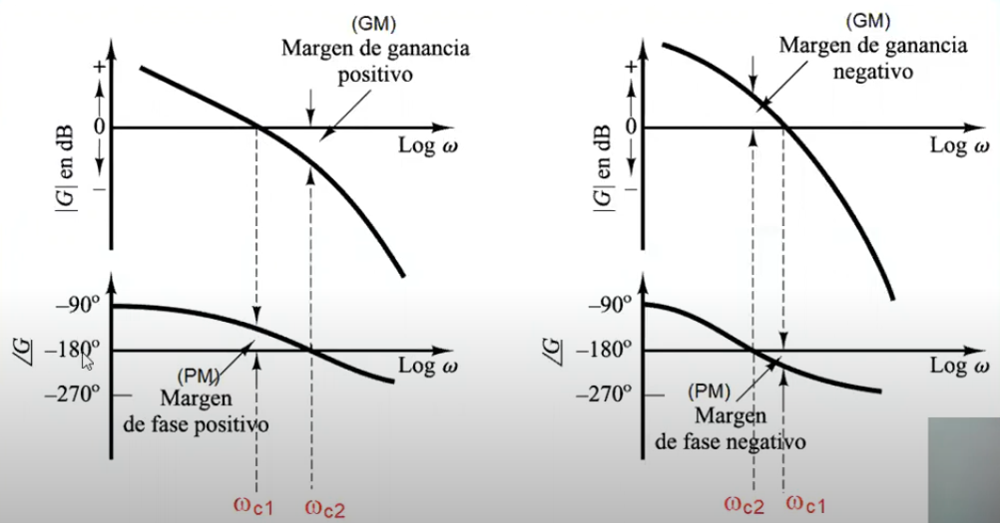
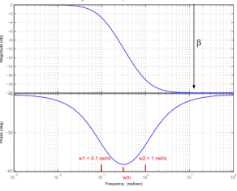

# Diseño de Redes de Atraso 

El diseño de redes de atraso es una técnica crucial en el control digital que se basa en la manipulación de las respuestas en frecuencia de un sistema. Este tipo de diseño permite ajustar la estabilidad y el rendimiento del sistema, minimizando problemas como el ruido o los errores en estado estacionario. A través del análisis del diagrama de Bode, se pueden identificar los márgenes de ganancia y fase, y determinar las modificaciones necesarias para cumplir con los requisitos de estabilidad y velocidad de respuesta.

## 1.Controladores por Análisi en Frecuencia

Los controladores diseñados mediante análisis en frecuencia se emplean en aplicaciones donde es importante ajustar el margen de fase y ganancia para mantener el sistema estable. Un controlador PID, por ejemplo, es una combinación de redes de adelanto y atraso que afecta tanto las respuestas en baja como en alta frecuencia.

>🔑 *Controlador PID:* Un controlador que combina acciones proporcionales, integrales y derivativas para mejorar la estabilidad y el tiempo de respuesta de un sistema.

### 1.1.Redes de adelanto de fase

La compensación por adelanto de fase mejora significativamente la respuesta transitoria del sistema, lo que permite una mayor velocidad de respuesta y un incremento en el ancho de banda y los márgenes de estabilidad. Sin embargo, este tipo de compensación también tiene el inconveniente de amplificar el ruido en altas frecuencias debido al aumento de la ganancia en esas bandas, lo que puede afectar el rendimiento general del sistema.

### 1.2.Redes de atraso de fase

La compensación por atraso de fase disminuye la ganancia en altas frecuencias sin afectar las bajas, lo que reduce el ancho de banda del sistema y, en consecuencia, disminuye su velocidad. Sin embargo, esta compensación mejora notablemente la precisión en estado estacionario y suprime eficazmente el ruido en frecuencias altas, aunque esto ocurre a costa de un mayor tiempo de respuesta transitoria.

### 1.3.Redes de Atraso - Adelante de fase

El compensador de atraso-adelanto integra los beneficios de ambos tipos de compensación, lo que facilita la mejora en los márgenes de estabilidad, el aumento del ancho de banda y la disminución del error en estado estacionario, todo sin incrementar el ruido. No obstante, este tipo de compensador aumenta el orden del sistema en dos niveles, lo que añade complejidad y dificulta el control de la respuesta transitoria, a diferencia de los compensadores de atraso o adelanto individuales, que solo incrementan el orden en uno.

## 2.Margenes de Fase y Ganancia

### 2.1.Margen de Ganancia

 * Es el cambio en la ganancia de lazo abierto de un sistema que se requerie para que el Sistema en lazo cerrado sea inestable,
 * Esta parte se mide en decibeles(dB)
 * Se mide tomando como referencia la fase de -180°
 * Ayuda a definir la estabilidad del sistema

### 2.2.Margen de Fase

 * Es el cambio en la fase de lazo abierto, requerido para que el Sistema en lazo cerrado sea inestable
 * Se mide en grados(°)
 * Se toma como referencia de medida la ganancia unitario (0dB)
 * MP > −180° Positivo o MP < −180° Negativo

### 2.3.Medida de Margenes de Estabilidad

Figura 1. Imagen de medidas MG y MP

## 3.Consideraciones

Si los márgenes de ganancia (MG) y de fase (MP) son positivos, el sistema se mantiene estable en lazo cerrado. Es ideal que estos márgenes sean lo más grandes posible para asegurar la estabilidad. Sin embargo, si MG y MP son cero o negativos, el sistema puede volverse inestable en lazo cerrado.

## 4. Con respeto a respuesta temporal

Para un sistema de segundo orden continuo: 

$$\[
G_o = \frac{\omega_n^2}{s^2 + 2\zeta\omega_n s + \omega_n^2}
\]$$

* Margen de ganancia $\geq$ 10dB, Margen de fase $\geq$ 45° --> $M_r$ $\approx$ 1.3
* Margen de ganancia $\geq$ 12dB, Margen de fase $\geq$ 60° --> $M_r$ $\approx$ 1.0

### 4.1 Parámetros que depende el margen de fase

$$\[
G_o = \frac{\omega_n^2}{s^2 + 2\zeta\omega_n s + \omega_n^2}
\]$$

Usualmente se aproxima a: $\phi_{m}=100\xi$

El margen de fase y el %overshoot están relacionados de la siguiente manera:

$$\phi_{m}=tan^{-1}\left[\frac{2\xi}{\left(\sqrt{4\xi^{4}+1-2\xi^{2}}^{1/2} \right)}\right]$$

## 5.Procedimiento de diseño

* Discretizar la planta analógica para obtener un equivalente G(z)
* Transformar G(z) a G(w) mediante la transformación bilineal dada por:

$$z =\frac{1+\frac{T}{2}w}{1-\frac{T}{2}w} $$

* Graficar los diagramas de bodel para la función G(w)
* Aplicar el método de diseño para C(w)
* Recuperar C(z) a partir de G(w) para poder programarlo

$$w = \frac{2}{T} \frac{z - 1}{z + 1}$$

## 6.Redes de atraso

Esta dada por una fucnión que va a controlar el sistema el cual es el siguiente: 0<a<1

$$C\left[w\right]=\frac{1+aT_{1}w}{1+T_{1}w}$$

El diagrama de esto puede es:

Figura 2. Diagrama de red de atraso

### 6.1. Metodología de diseño de red de atraso

* Determinar Kp  para asegurar que se cumpla el requisito de error
* Posteriormente, medir los márgenes de estabilidad considerando el valor de Kp
* Luego, calcular la frecuencia necesaria para obtener $M_p+6°$ , estableciendo esta frecuencia como la nueva condición G=0
* Finalmente, medir la atenuación requerida a esa frecuencia para cumplir con el margen de fase establecido.

$\alpha=-20\log a$ , $a=10^{\frac{-\alpha}{20}}$

*Calcular T1:

$$\frac{1}{T_{1}a}=\frac{\omega_G}{10}$$

## 7.Conclusiones

El diseño de redes de atraso permite ajustar la estabilidad del sistema disminuyendo la ganancia en altas frecuencias y reduciendo la sensibilidad al ruido. Es una herramienta esencial en el control digital, donde se busca un equilibrio entre velocidad de respuesta y estabilidad, especialmente en sistemas afectados por ruido en alta frecuencia.

## 8.Referencias

1. C. Chen, Analog and digital control system design, Saunders College Publishing.
2. Tomado de: https://repository.unad.edu.co/bitstream/handle/10596/5790/documents.mx_compensacion-de-adelanto-retraso-y-adelanto-retraso-de.pdf;jsessionid=5FB2A590F2D2D3417692CD24D02A8985?sequence=1
3. http://scielo.senescyt.gob.ec/scielo.php?script=sci_arttext&pid=S2602-84922019000100076
​
 

